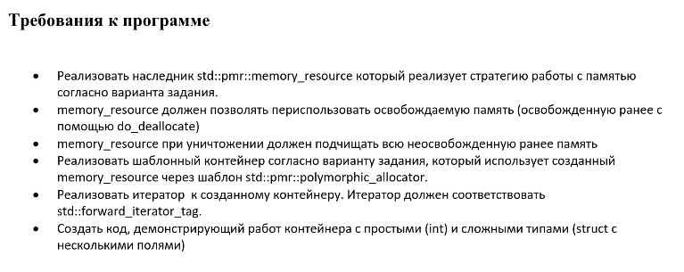

# Лабораторная работа №5. Вариант 16.

## Требования к программе


## Вариант


Стратегия работы memory_resource:
4. Динамическое выделение памяти: для каждого объекта выделяется блок памяти на куче, информация о выделенных блоках сохраняется в std::list.

## Краткий разбор реализации

В ходе работы реализован шаблонный динамический массив `PmrVector<T>`, использующий собственный memory_resource `ListMemoryResource` через `std::pmr::polymorphic_allocator`.

По условию стратегия работы memory_resource такова: "один объект - один блок".
При этом ранее освобождённая память переиспользуется. При уничтожении ресурса освобождаются все блоки памяти.

Итератор `VectorIterator<T>` соответствует `std::forward_iterator_tag`, поддерживает операции: разыменовывания, инкремента и сравнения.

Контейнер корректно работает с простыми типами (`int`) и сложными структурами (`struct Employee`, `std::string` и т.п.).


### Основные методы работы контейнера `PmrVector<T>`:
- `push_back(const T&)` - добавление элемента;
- `pop_back()` - удаление последнего элемента;
- `front() / back()` - доступ к первому/последнему элементу
- `size() / capacity() / empty()` - получение размера/вместимости, проверка на пустоту
- `clear()` - удаление всех элементов
- `begin() / end()` - итераторы для прохода по элементам

### Кратко о работе memory_resource:
- Для **каждого объекта** выделяется отдельный блок памяти;
- Освобождённая память помечается как свободная, и может быть переиспользована при последующих аллокациях;
- При вызове деструктора освобождаются все оставшиеся блоки памяти.


## Сборка и запуск лабораторной

### Сборка:
```bash
cd lab_5
mkdir build
cd build
cmake ..
cmake --build .
```

### Запуск:
```bash
# Из директории build
./lab5_exe
```

### Запуск тестов:
```bash
# Из директории build
./tests
```
